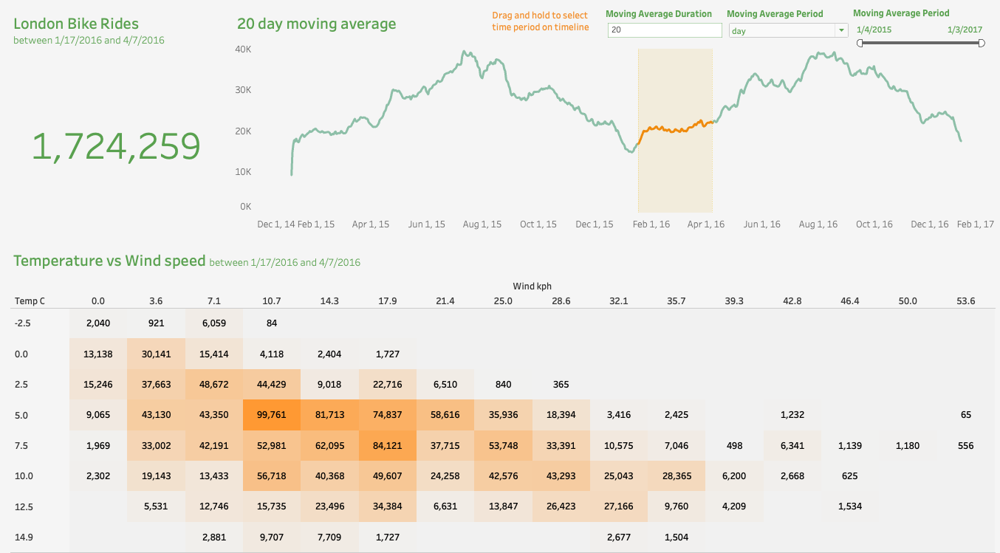
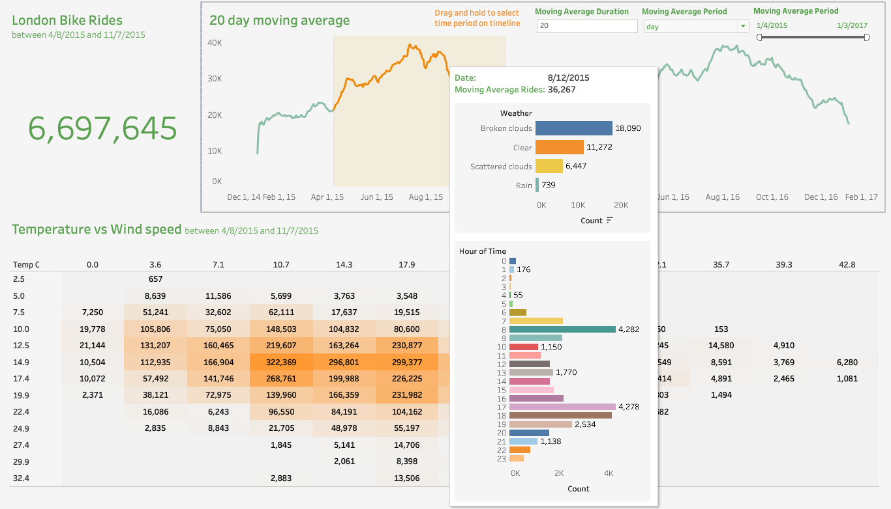
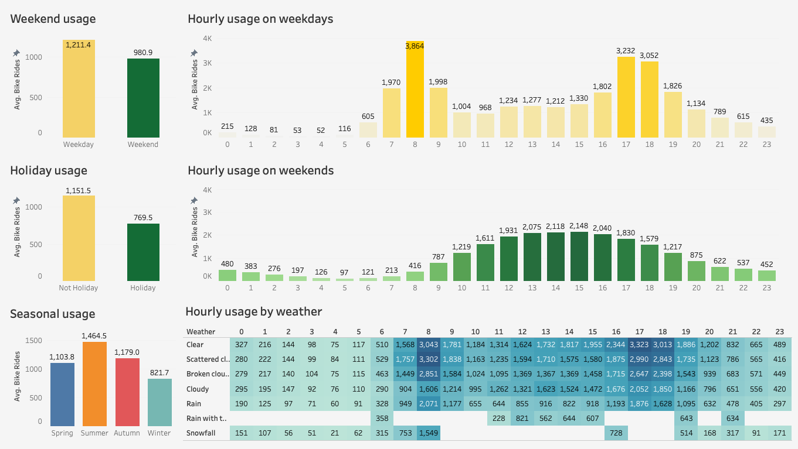

### About this project

In this project, I practiced the following:

-   Data preprocessing using Python: - Renaming columns & data mapping.
     

-   Data visualization using Tableau: - Created interactive dashboard. - Set a date range filter that allows viewers to select a specific timeframe for analysis. - Dynamically connect data to show filtered results. - Utilize heatmap for pattern identification. - Apply moving averages to spot trends over time. - Embed dynamic data in tooltips for richer insights.
     

### Check out the dashboard on Tableau Public

🔗 Link: [Click here](https://public.tableau.com/views/PracticeLondonBikeRides/Dashboard1?:language=en-US&:sid=&:display_count=n&:origin=viz_share_link)

 
 

 
 

 

### Anaylsis

1. **Weekend Usage**:  Bike rentals are higher on weekdays (1,211.4 average bike rentals) compared to weekends (980.9 average bike rentals) by _23.50%_. This could indicate that bikes are used more for commuting during the workweek.

2. **Holiday Usage**:  Similar to weekends, average bike rentals on non-holidays(1,151.5 average bike rentals) is higher than on holidays(769.5 average bike rentals) by _49.64%_. This could suggest that the share bikes are less used for leisure or that people prefer other activities during holidays.

3. **Seasonal Usage**:  Average bike usage in summer(1,464.5 average bike rentals) is higher than in winter(1,179.0 average bike rentals) by _24.22%_, which may be related to better weather conditions in the summer, making biking more appealing.

4. **Hourly Usage on Weekdays**:  There are two peak times for bike rentals on weekdays: around 8 AM (3,864 average bike rentals) and 5 PM (3,232 average bike rentals). These are typical commuting hours, which reinforces the idea that bike rentals are likely used for commuting to and from work.

5. **Hourly Usage on Weekends**:  The pattern is different on weekends, with a more gradual increase starting around 9 AM, peaking at 2 PM (2,075 average bike rentals), and then decreasing. This suggests a more recreational or errand-based use of bikes, spread throughout the day.

6. **Hourly Usage by Weather**:  The highest bike rental counts are observed in clear weather throughout the day, with peak rentals at 5 PM (3,323 average bike rentals). The lowest counts are during rain with thunderstorm, especially in the early hours (0-5 AM). This shows weather conditions significantly affect bike rental patterns.

 

### Conclusions

-   **Commuting vs. Leisure**: The data suggests a strong commuting pattern during weekdays and a leisure pattern during weekends and holidays.
-   **Weather Dependence**: Weather has a notable impact on bike rental patterns, with clear and cloudy days facilitating more rentals, while rain and snowfall deter them.
-   **Seasonal Influence**: There's a seasonal variation in bike rentals, with warmer seasons being more favorable for biking activities.

 

### Dataset Source

🔗 Link: https://www.kaggle.com/datasets/hmavrodiev/london-bike-sharing-dataset
