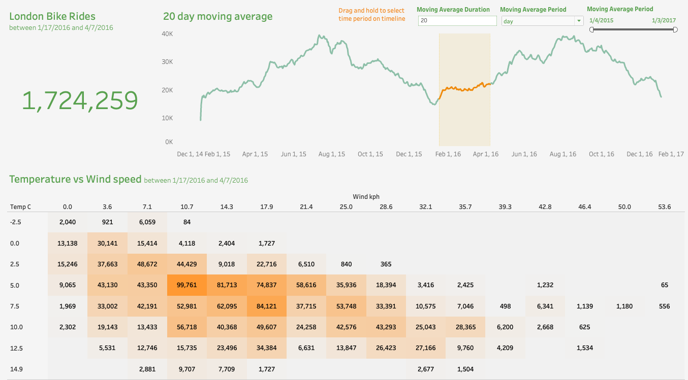
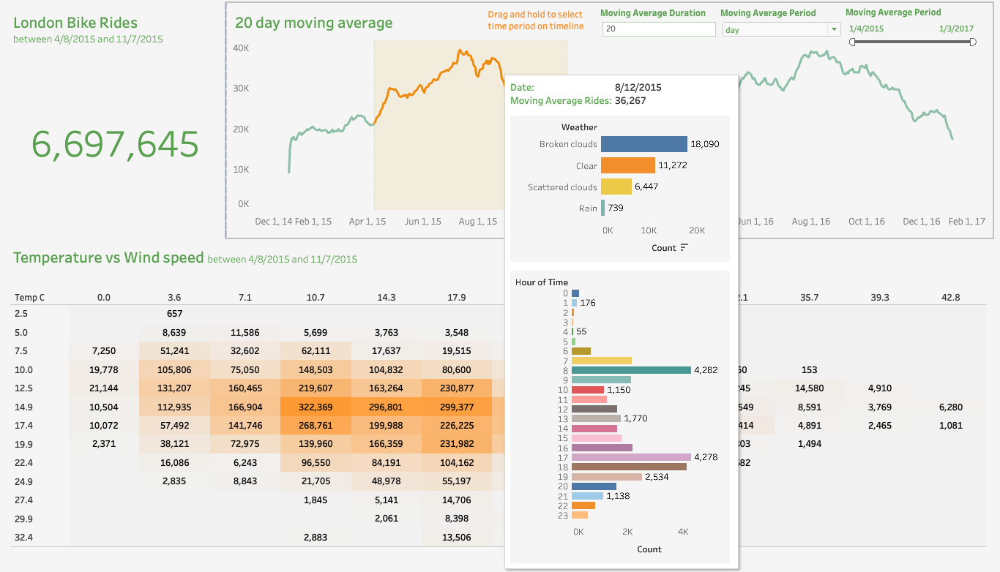

### About this project

In this project, I practiced the following:

-   Data preprocessing using Python: - Renaming columns & data mapping.
     
-   Data visualization using Tableau: - Created interactive dashboard. - Set a date range filter that allows viewers to select a specific timeframe for analysis. - Dynamically connect data to show filtered results. - Utilize heatmap for pattern identification. - Apply moving averages to spot trends over time. - Embed dynamic data in tooltips for richer insights.
     

### Check out the dashboard on Tableau Public

🔗 Link: https://shorturl.at/stQW6

 

